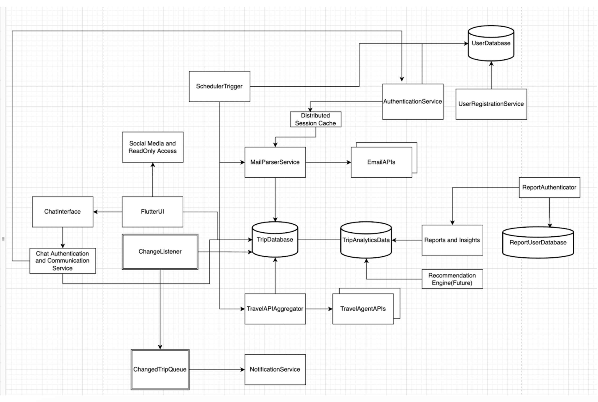

# Overall Architecture

## Description
The application would follow the microservice architecture style. The two key services are MailParserService and TravelAPIAggregator. 

MailParserService is responsible to read the emails and check for trip related emails and updates from them. It parses the mails based on whitelisting of the user and /or based on keywords of travel, booking and trips. 

TravelAPIAggregator is an event listener as well as API invoker. Based on the external agencies capabilities it calls the APIs or provides listeners or hooks for them to notify trip related information.

Both these services use an inbuilt logic to construct trip data and store them into the TripDatabase which is a NoSQL database.

The other key services are AuthenticationServices for users and data consumers(UserDatabase), a reporting analytics database for generating long term data insights(TripAnalyticsData), and a chat/help interface with the preferred travel agent of the user.

We recommend Flutter as the UI technology which provides rich user interface experience and is a framework where we can write once and run on multiple devices and browsers.

There is a notification triggered from the system if the TripData is changed and there is a listener(ChangeListener) and queue(ChangedTripQueue) capabilities required for the same.

(components flow represented in the diagram below)

### Diagram 

